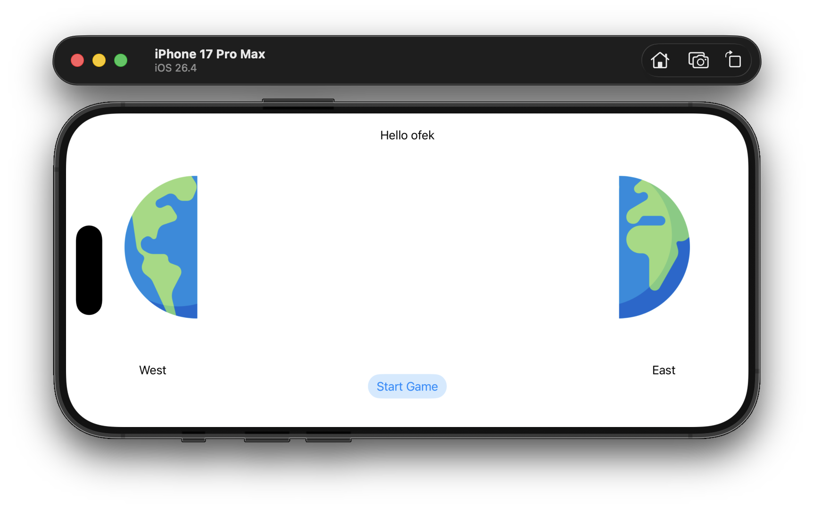
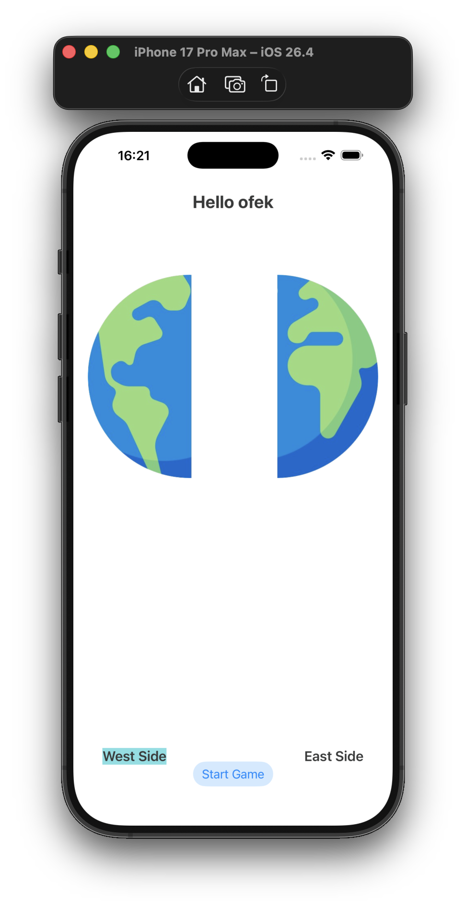
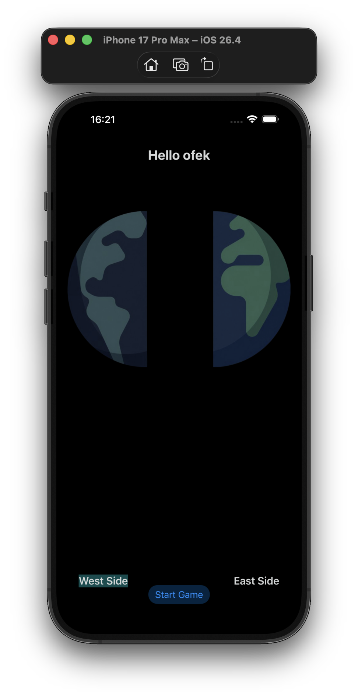
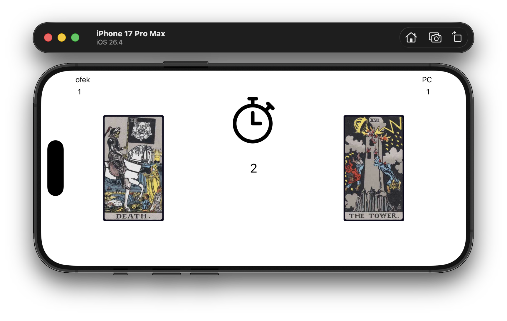
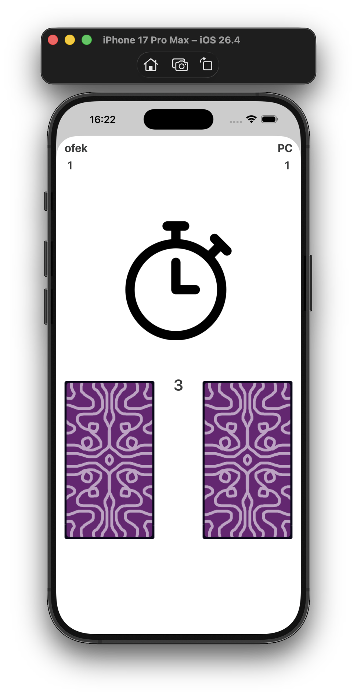
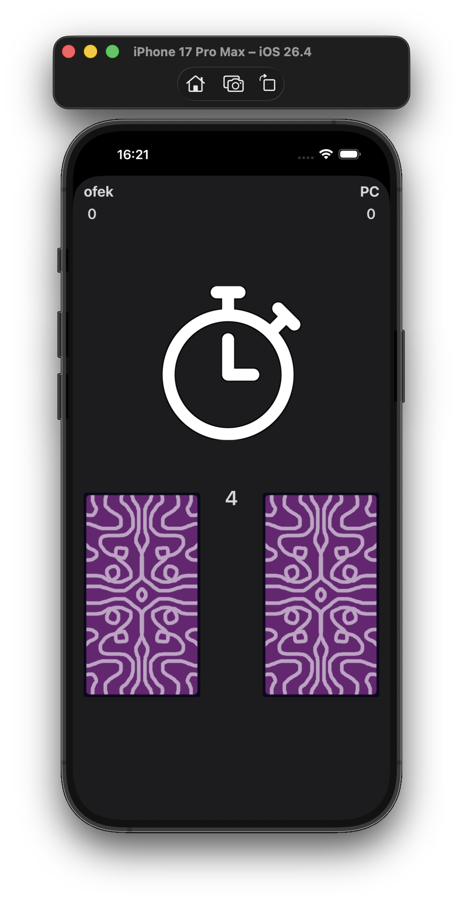
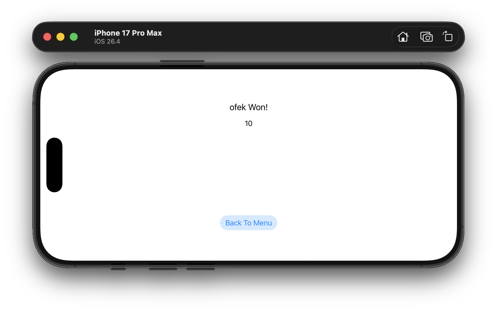
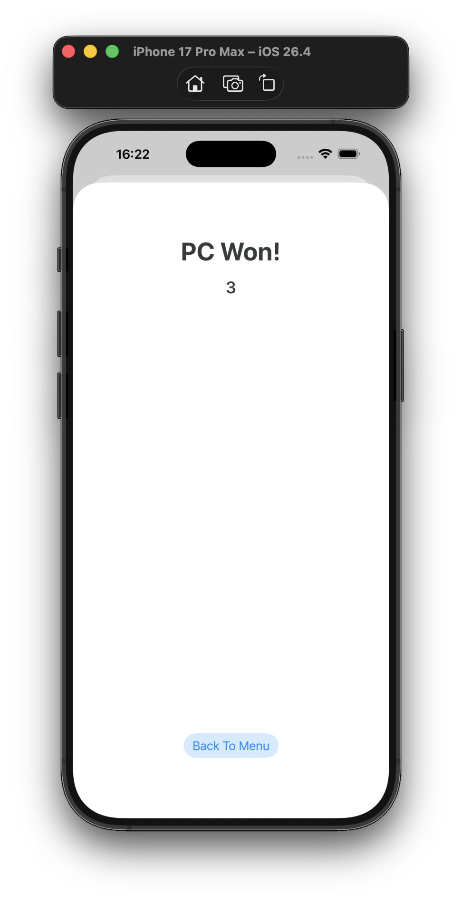
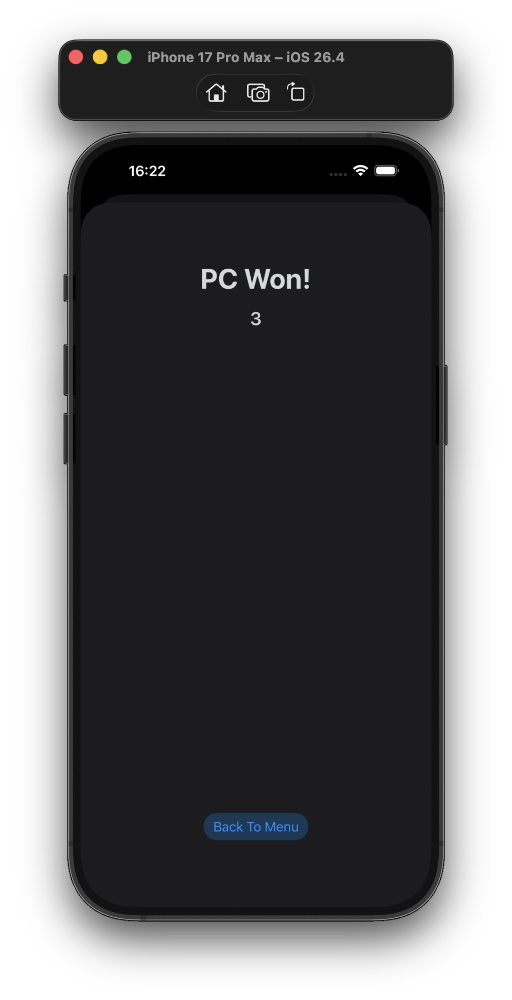

# Card Game

Project for a IOS Development course, in Afeka - the academic college of Engineering in Tel Aviv.

# Overview

Card Game is a War - card game theme game application using Swift, in the game you should get higher card than the Pc in order to get a point, the first to 10 is the Winner!

For demonstration check the video in the project files

## Getting Started

In order to start the game you must:
-  Have a name inserted
-  Give permission to get location

 
## App Screens
#### Start Screen: 
 - Enter your name
- Give premission to location

| Landscape | Portrait | Dark |
|---|---|---|
||
||
||

#### Game Screen:

-  Hope to get the better Card!
-  Score 10 points in order to Win!
 
| Landscape | Portrait | Dark |
|---|---|---|
||
||
||

#### End Game Screen:

- Return to start screen

| Landscape | Portrait | Dark |
|---|---|---|
||
||
||

